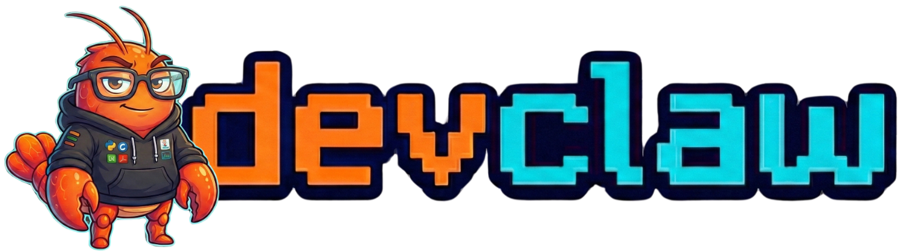

# DevClaw

> AI agent for tech teams. Single binary. Runs everywhere.

[](https://github.com/jholhewres/devclaw/releases)
[](LICENSE)
[](https://go.dev)
[](https://github.com/jholhewres/devclaw/actions/workflows/ci.yml)

<p align="center">
  
</p>

Open-source AI agent for tech teams. Single Go binary with CLI, WebUI, MCP server, and messaging channels. Full system access, persistent memory, encrypted vault, and 90+ built-in tools.

**Not a chatbot. Not an IDE. Not a framework.** DevClaw is the AI backend that IDEs, terminals, and channels access — giving any tool persistent memory, infrastructure access, and integrations.

[**Docs**](docs/) | [**Getting Started**](#quick-start) | [**Skills**](https://clawhub.ai/) | [**Releases**](https://github.com/jholhewres/devclaw/releases)

---

## Quick Start

```bash
# Linux/macOS — one-command install
bash <(curl -fsSL https://raw.githubusercontent.com/jholhewres/devclaw/master/install/unix/install.sh)

# Docker
git clone https://github.com/jholhewres/devclaw.git && cd devclaw
docker compose up -d

# From source (Go 1.24+ & Node 22+)
git clone https://github.com/jholhewres/devclaw.git && cd devclaw
make build && ./bin/devclaw serve
```

Open **http://localhost:47716/setup** to configure your API key.

See [install/DEPLOYMENT.md](install/DEPLOYMENT.md) for all install options (Docker, systemd, Ansible, Windows, uninstall).

---

## Highlights

```
Interfaces: CLI / WebUI / WhatsApp / Telegram
     │
     ▼
Assistant (agent loop) ─── LLM Client (9 providers, N-fallback)
     │
     ├── Tools (90+)        — files, git, docker, databases, testing, deploy
     ├── Memory (SQLite)    — FTS5 + vector embeddings, persistent across sessions
     ├── Subagents (8x)     — concurrent child agents with isolated sessions
     ├── MCP Server         — stdio + SSE for IDE integration
     └── Plugin System      — YAML-first agents, tools, hooks, skills
```

- **9 LLM providers** with N-provider fallback chain and budget tracking
- **90+ tools** across 22 categories (files, git, docker, databases, testing, ops, media, web)
- **MCP server** for IDE integration (Cursor, VSCode, Windsurf, Zed, Neovim)
- **Plugin agents** with custom instructions, triggers, and bidirectional escalation
- **Encrypted vault** (AES-256-GCM + Argon2id) for all secrets
- **Pipe mode** — `git diff | devclaw diff` or `npm build 2>&1 | devclaw fix`
- **Skills** — install from [ClawHub](https://clawhub.ai/) or create your own

---

## CLI

```bash
devclaw serve                  # Start daemon with channels + WebUI
devclaw chat "message"         # Single message or interactive REPL
devclaw mcp serve              # MCP server for IDE integration

devclaw fix [file]             # Analyze and fix errors
devclaw explain [path]         # Explain code or directories
devclaw diff [--staged]        # AI review of git changes
devclaw commit [--dry-run]     # Generate commit message and commit
devclaw how "task"             # Generate shell commands

git diff | devclaw "review"    # Pipe mode
```

---

## MCP Server

```bash
devclaw mcp serve    # starts MCP server on stdio
```

```json
{
  "mcpServers": {
    "devclaw": {
      "command": "devclaw",
      "args": ["mcp", "serve"]
    }
  }
}
```

Works with Cursor, VSCode, Windsurf, Zed, Neovim, and any MCP-compatible client.

---

## Documentation

| Topic | Link |
|-------|------|
| Architecture | [docs/architecture.md](docs/architecture.md) |
| Features | [docs/features.md](docs/features.md) |
| Tools (90+) | [docs/features.md#tools](docs/features.md) |
| Channels | [docs/channels.md](docs/channels.md) |
| Plugins | [docs/plugins.md](docs/plugins.md) |
| Security | [docs/security.md](docs/security.md) |
| Performance | [docs/performance.md](docs/performance.md) |
| Skills Catalog | [docs/skills-catalog.md](docs/skills-catalog.md) |
| Deployment | [install/DEPLOYMENT.md](install/DEPLOYMENT.md) |
| Configuration | [configs/devclaw.example.yaml](configs/devclaw.example.yaml) |

---

## Author

**Jhol Hewres** — [@jholhewres](https://github.com/jholhewres)

## License

[MIT](LICENSE)
